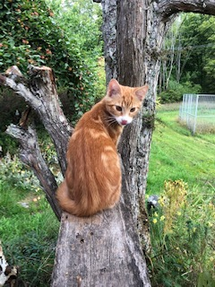
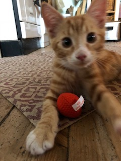

<!DOCTYPE html>
<html>
  <head>
    <meta charset="utf-8">
    <meta http-equiv="Content-Type" content="text/html" charset="iso-8859-1">
    <title>My web project</title>
    
  </head>
  <body>
  

<link href="https://fonts.googleapis.com/css?family=Indie+Flower" rel="stylesheet">

<h1 class="mitten">Kalle(s) kula</h1>

<h3 class="mitten rubrik">Världen enligt katten Kalle</h3>

Här kan du följa mig på mina utflykter och mina äventyr i naturreservatet där jag lever.       
Min bästa kompis är – i brist på kattkompisar här på gården – min "bror", hunden Moltas, en dvärgschnauzer. Honom kommer jag skriva mycket om, för jag tycker mycket om honom.

  

<h3 class="sidorutor">Om mig</h3>
<h3 class="sidorutor">Min värld</h3>
<h3 class="sidorutor">Min dag</h3>
<h3 class="sidorutor">Min familj</h3>
<h3 class="sidorutor">Mina bilder</h3>  
<h3 class="sidorutor">Mina tips</h3>
<h3 class="sidorutor">Mina länkar</h3>

  

  </body>
</html>
